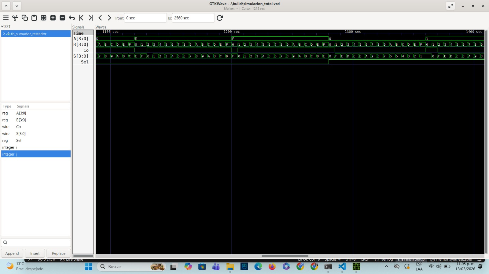

# Lab02 - Sumador/Restador de 4 bits

# Integrantes
* Omar David Garay Osorio cod. 133729
* Cesar Agusto Carrasco Hastamorir 130783
* Gerardo Steven Loaiza Ortiz 134549

# Informe

Indice:

1. [Documentación](#documentación-de-los-circuitos-implementados-implementado)
2. [Simulaciones](#simulaciones)
3. [Evidencias de implementación](#evidencias-de-implementación)
4. [Preguntas](#preguntas)
5. [Conclusiones](#conclusiones)
6. [Referencias](#referencias)

## Documentación del diseño implementado

### 1. Sumador/Restador

#### 1.1 Descripción
En el  presente laboratorio se realiza la implementación de un sumador restador  capaz de realizar operaciones aritméticas de suma y resta con 4 bits. Para optimizar los recursos del hardware, se utilizó el principio matemático del complemento a 2, el cual permite codificar números negativos en binario y transformar las restas en sumas. Esto hizo posible reutilizar la arquitectura de un sumador estándar, añadiendo únicamente compuertas lógicas y una señal de control, simplificando significativamente el diseño.

El diseño se realizó de forma modular en lenguaje de descripción  (HDL) Verilog, estructurándose en tres niveles:

1.Módulo `sumador_1`:
Es la unidad fundamental (Full Adder) que suma dos bits individuales (A y B)
junto con un acarreo de entrada (`Ci`), produciendo un bit de suma (`So`) y un
acarreo de salida (`Co`).

2.Módulo `sumador_4bits`:
Se construyó instanciando cuatro módulos `sumador_1` conectados en cascada
(Ripple Carry Adder). El acarreo de salida de cada bit menos significativo
se conecta a la entrada de acarreo del bit inmediatamente superior.

3.Módulo sumador_restador (Top Level):
Es el circuito final que integra el sumador de 4 bits y la lógica para el
complemento a 2. Incorpora una señal de control Sel (Selector) donde:

`Sel = 0` → realiza una suma
`Sel = 1` → realiza una resta

Fundamento lógico de la resta (Complemento a 2)

Matemáticamente, la resta A - B se transforma en una suma mediante:

A - B = A + (~B + 1)

donde ~B representa la inversión de bits (complemento a 1).

En el código esto se implementa de la siguiente manera:

Paso 1 (Inversión):
Se utilizan compuertas XOR:

`assign B_xor[0] = B[0] ^ Sel;`

Si     `Sel = 1`, la compuerta invierte los bits del operando B.
Si     `Sel = 0`, los bits pasan sin modificarse.

Paso 2 (+1):
La señal Sel se conecta directamente a la entrada de acarreo inicial (`Ci`)
del sumador_4bits. Por lo tanto, cuando     `Sel = 1` (resta), se suma
automáticamente un 1 al resultado invertido, completando así
la operación de complemento a 2.

El bit de acarreo final (`Co`) permite interpretar el resultado en las
operaciones de resta. Un `Co = 1` indica un resultado positivo, mientras que un `Co = 0` indica un resultado negativo expresado en complemento a 2.

#### 1.2 Diagramas

DIAGRAMA RTL 

## Simulaciones 

### 1. Simulación del sumador/restador

#### 1.1 Descripción
Para verificar y validar el correcto funcionamiento del diseño antes de su implementación física, se realizó una simulación empleando el software Icarus Verilog. La simulación es un paso importante en el diseño digital, ya que permite identificar y corregir errores de lógica observando el comportamiento de las señales en el tiempo.Se elaboró un testbench (banco de pruebas) para estimular las entradas `A`, `B` y `Sel` del módulo Vsumador_restadorV. Se probaron diferentes casos de uso:Suma normal (`Sel = 0`): Se verificó que el circuito sumara correctamente números sin generar alteraciones en el operando B.Resta con resultado positivo (`Sel = 1`): Ejemplo conceptual como $7 - 5$, donde el sistema calcula el complemento a 2 de 5 ($0101_2 \rightarrow 1010_2 + 1 = 1011_2$) y realiza la suma $0111_2 + 1011_2 = 10010_2$. Se descartó el acarreo final (MSB) para obtener el resultado de $0010_2$ (2 en decimal).Resta con resultado negativo (Sel = 1): Casos donde el minuendo es menor que el sustraendo (ej. $3 - 7$), verificando que el acarreo de salida sea 0 y el resultado se presente correctamente en formato complemento a 2

#### 1.2 Diagrama

## Evidencias de implementación

La fase del laboratorio consistió en llevar el diseño creado en Verilog a un entorno de hardware físico. Para ello, utilizamos  el entorno de desarrollo Quartus, el cual nos permitió realizar el enrutamiento del código hacia la tarjeta de desarrollo FPGA.

El proceso de implementación se dividió en las siguientes etapas:

Asignación de Pines (Pin Planner): Para poder interactuar físicamente con el circuito, se configuraron los periféricos de entrada y salida de la tarjeta.

Las entradas de datos `A[3:0]` y `B[3:0]` se asignaron a ocho interruptores deslizantes (switches) contiguos, permitiendo introducir los valores binarios manualmente.

La señal de control `Sel` se asignó a un interruptor independiente para alternar fácilmente entre el modo suma (`Sel = 0`) y el modo resta (`Sel = 1`).

Las salida fueron asignadas al resultado `S[3:0]` y el bit de acarreo final `Co` se conectaron a lod  diodos LED de lla fpga. Esto permitió una visualización instantánea del comportamiento de la lógica combinacional.

Validación Física: Una vez programada la FPGA, se procedió a validar el circuito introduciendo con varios casos de prueba (previamente verificados en la simulación con Icarus Verilog). Se observó en tiempo real cómo la conmutación del bit Sel alteraba el flujo de datos del operando B a través de las compuertas XOR, confirmando visualmente en los LEDs la correcta ejecución matemática del complemento a 2 y la entrega del resultado final.

# Ejemplo 1
### 3.1. Análisis detallado de la operación en Hardware: $9 - 6$

Para validar el funcionamiento lógico del sumador/restador implementado en la FPGA, se realiza el análisis paso a paso de la operación aritmética $9 - 6$. El objetivo es demostrar cómo la arquitectura descrita en Verilog procesa las señales eléctricas a nivel de bits para obtener el resultado correcto mediante la técnica de complemento a 2.

**1. Definición de las entradas:**
En los interruptores (*switches*) de la FPGA se configuran los siguientes valores binarios de 4 bits:
* **Minuendo ($A$):** $9_{10} = 1001_2$
* **Sustraendo ($B$):** $6_{10} = 0110_2$
* **Señal de control ($Sel$):** $1$ (Modo resta activado)

**2. Obtención del complemento a 1 (Capa de compuertas XOR):**
El operando $B$ atraviesa las compuertas lógicas XOR. Como $Sel = 1$, las compuertas actúan como inversores lógicos de cada bit de la entrada $B$.
* $B\_xor = B \oplus Sel$
* $B\_xor = 0110_2 \oplus 1111_2 = 1001_2$

**3. Suma binaria con acarreo inicial (Complemento a 2 en hardware):**
El hardware no calcula el complemento a 2 en un paso aislado, sino que lo integra directamente en el sumador de 4 bits (*Ripple Carry Adder*). Al módulo sumador ingresan tres elementos: el operando $A$ ($1001_2$), el operando $B$ invertido ($1001_2$) y el acarreo inicial $Ci$ que está conectado directamente a $Sel$ ($Ci = 1$). 

La operación que el hardware ejecuta es: $A + B\_xor + Ci$.
A continuación, se desglosa el comportamiento lógico interno bit a bit (desde el menos significativo al más significativo):

* **Bit 0 (`sumador_1 bit0`):**
  * Entradas: $A_0 = 1$, $B\_xor_0 = 1$, $Ci = 1$
  * Suma: $1 + 1 + 1 = 3_{10}$ (en binario $11_2$)
  * Salidas: $S_0 = \mathbf{1}$ | Acarreo hacia bit 1 ($c_1$) = $\mathbf{1}$

* **Bit 1 (`sumador_1 bit1`):**
  * Entradas: $A_1 = 0$, $B\_xor_1 = 0$, $Ci = c_1 = 1$
  * Suma: $0 + 0 + 1 = 1_{10}$ (en binario $01_2$)
  * Salidas: $S_1 = \mathbf{1}$ | Acarreo hacia bit 2 ($c_2$) = $\mathbf{0}$

* **Bit 2 (`sumador_1 bit2`):**
  * Entradas: $A_2 = 0$, $B\_xor_2 = 0$, $Ci = c_2 = 0$
  * Suma: $0 + 0 + 0 = 0_{10}$ (en binario $00_2$)
  * Salidas: $S_2 = \mathbf{0}$ | Acarreo hacia bit 3 ($c_3$) = $\mathbf{0}$

* **Bit 3 (`sumador_1 bit3` - MSB):**
  * Entradas: $A_3 = 1$, $B\_xor_3 = 1$, $Ci = c_3 = 0$
  * Suma: $1 + 1 + 0 = 2_{10}$ (en binario $10_2$)
  * Salidas: $S_3 = \mathbf{0}$ | Acarreo final de salida ($Co$) = $\mathbf{1}$

**4. Interpretación del Resultado final:**
Al consolidar las salidas del sumador, obtenemos:
* **Magnitud ($S$):** $S_3 S_2 S_1 S_0 = 0011_2$. Al convertir este valor binario a decimal, obtenemos el número **$3$**, que corresponde exactamente a la magnitud de la resta $9 - 6$.
* **Acarreo Final ($Co$):** $Co = 1$. En el contexto del complemento a 2, un acarreo de salida en nivel lógico alto confirma que el resultado de la operación es **positivo**.

**Evidencia física:**
Como se puede observar en la fotografía de la implementación física (tarjeta FPGA encendida), los LEDs asignados a los pines de salida reflejan fielmente este comportamiento teórico. El LED correspondiente al acarreo de salida ($Co$) se encuentra iluminado, validando el signo positivo, mientras que el banco de LEDs correspondientes a la magnitud ($S$) muestran el patrón lógico encendido/apagado correspondiente a la cadena binaria `0011`.

## Conclusiones
ficiencia del hardware: Se comprobó que el uso del complemento a 2 es un método altamente eficiente para los sistemas digitales, ya que permite reutilizar un bloque sumador preexistente para realizar restas. Con la simple adición de compuertas XOR y el manejo inteligente del acarreo de entrada, se ahorra espacio lógico en la FPGA al evitar la construcción de un circuito restador independiente.

Importancia de la simulación: El uso de Icarus Verilog demostró ser una etapa indispensable en el flujo de diseño. Validar el RTL antes de la síntesis en Quartus garantizó que la lógica del complemento a 2 funcionara correctamente, evitando tiempos de depuración prolongados sobre el hardware físico.

Interpretación de resultados: Se consolidó el aprendizaje sobre cómo los sistemas digitales representan números negativos. Se evidenció físicamente que, en una resta, el bit de acarreo final (`Co`) deja de ser un simple indicador de desbordamiento de suma y pasa a ser el indicador del signo del resultado.

## Referencias

1. Guía de Laboratorio 02: Sumador/Restador de 4 bits. (Documento interno del curso).
2. Mano, M. M., & Ciletti, M. D. (2013). *Diseño digital* (5a. ed.). Pearson Educación.
3. Tocci, R. J., Widmer, N. S., & Moss, G. L. (2017). *Sistemas digitales: Principios y aplicaciones* (11a. ed.). Pearson Educación.
4. Palnitkar, S. (2003). *Verilog HDL: A Guide to Digital Design and Synthesis* (2nd ed.). Prentice Hall.
